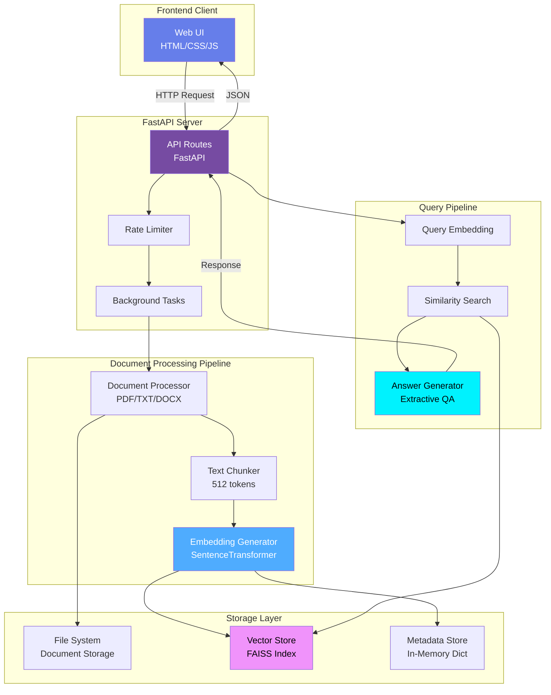
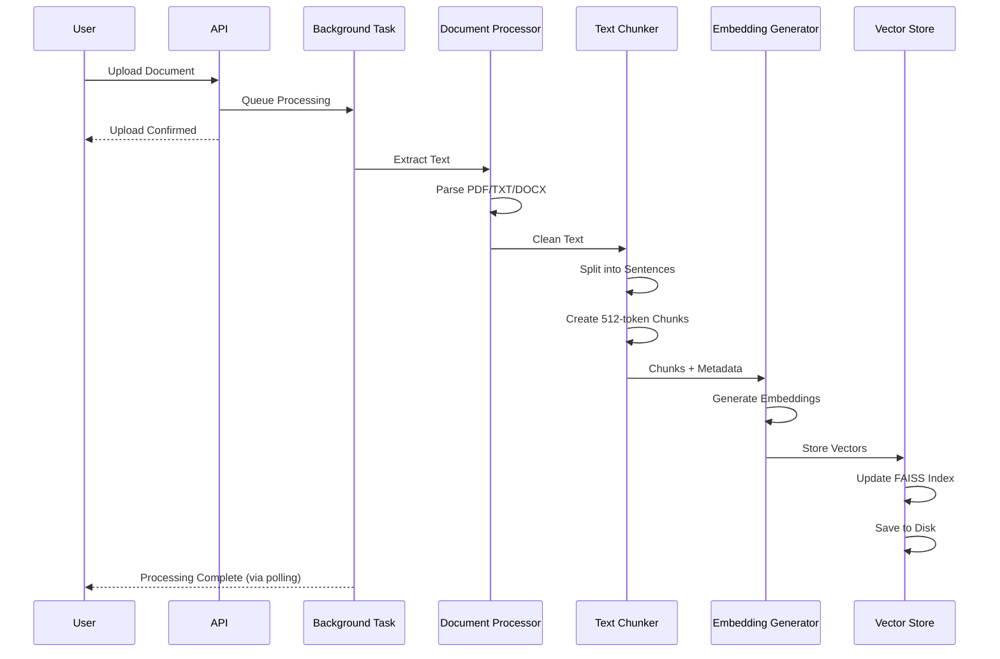
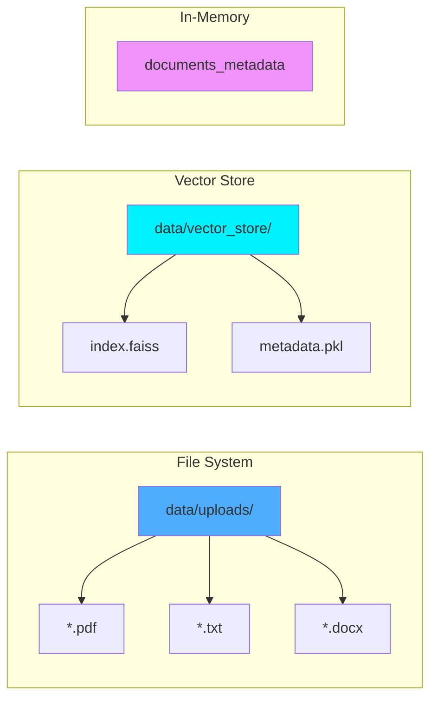
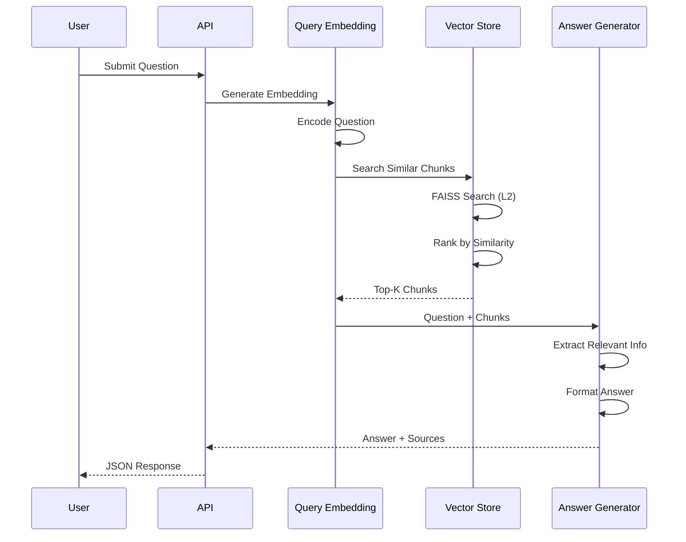
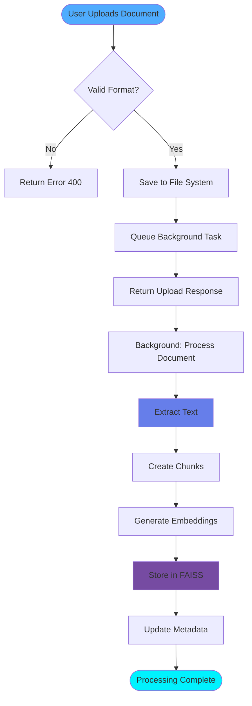
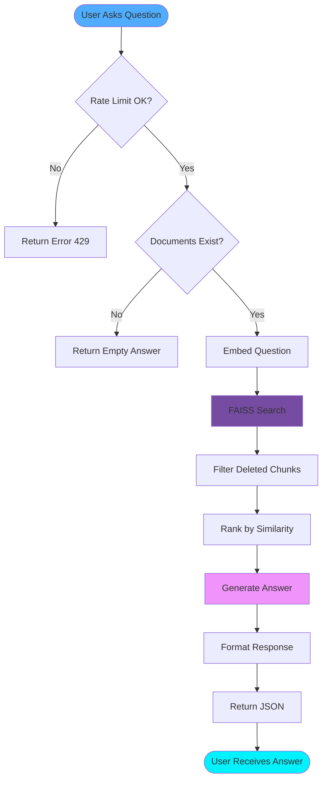
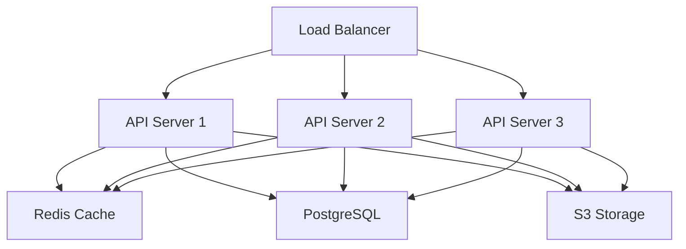

# System Architecture - RAG QA System

## Overview

This document describes the architecture of the RAG-based Question Answering System, including component interactions, data flow, and design decisions.

## High-Level Architecture



## Component Details

### 1. Frontend Layer

**Technology**: HTML5, CSS3, JavaScript (Vanilla)

**Responsibilities**:
- User interface for document upload and questions
- File validation and drag-and-drop
- Real-time feedback via toast notifications
- Answer display with source citations
- Responsive design for all devices

**Key Features**:
- Glassmorphism design with smooth animations
- Dark theme optimized for readability
- Accessibility features (keyboard shortcuts, focus states)

### 2. API Layer (FastAPI)

**Technology**: FastAPI, Uvicorn

**Components**:
- **Route Handlers**: RESTful endpoints for CRUD operations
- **Middleware**: CORS, rate limiting
- **Request Validation**: Pydantic models
- **Background Tasks**: Async document processing

**Endpoints**:
| Endpoint | Method | Purpose |
|----------|--------|---------|
| `/` | GET | Serve frontend |
| `/upload` | POST | Upload document |
| `/ask` | POST | Ask question |
| `/documents` | GET | List documents |
| `/documents/{id}` | DELETE | Delete document |
| `/health` | GET | Health check |

### 3. Document Processing Pipeline



**Document Processor**:
- Handles PDF, TXT, DOCX formats
- Extracts text with metadata (page numbers, etc.)
- Cleans text (remove extra whitespace, special chars)

**Text Chunker**:
- Sentence-aware splitting
- 512 tokens per chunk, 50-token overlap
- Preserves semantic boundaries
- Attaches metadata to each chunk

**Embedding Generator**:
- Uses `sentence-transformers/all-MiniLM-L6-v2`
- 384-dimensional embeddings
- Batch processing for efficiency
- Caching to avoid re-computation

### 4. Storage Layer



**File System**:
- Original documents stored with UUID filenames
- Organized by upload directory
- Preserved for potential re-processing

**FAISS Vector Store**:
- `IndexFlatL2`: Exact L2 distance search
- Serialized to disk for persistence
- Metadata stored separately in pickle format

**Metadata Store**:
- In-memory dictionary (production would use database)
- Tracks document status, chunk counts, upload dates
- Fast lookups for document management

### 5. Query Pipeline



**Query Embedding**:
- Same model as document embeddings (consistency)
- Single embedding per query
- Normalized for cosine similarity

**Similarity Search**:
- FAISS IndexFlatL2 for exact search
- Returns top-k chunks (default k=5)
- Filters deleted chunks
- Converts L2 distance to similarity score

**Answer Generator**:
- Extractive QA approach (no external API)
- Question-type detection (what/why/how)
- Combines top chunks into coherent answer
- Includes source citations

## Data Flow Diagrams

### Document Upload Flow



### Question Answering Flow



## Technology Stack

### Backend
- **Framework**: FastAPI 0.109
- **Server**: Uvicorn (ASGI)
- **Validation**: Pydantic 2.5
- **Embeddings**: sentence-transformers 2.3
- **Vector Store**: FAISS 1.7.4
- **ML Framework**: PyTorch 2.1
- **Document Processing**: PyPDF2, python-docx

### Frontend
- **Structure**: HTML5
- **Styling**: CSS3 (custom, no frameworks)
- **Scripting**: Vanilla JavaScript (ES6+)
- **Fonts**: Google Fonts (Inter, Poppins)

### Infrastructure
- **Storage**: Local file system
- **Rate Limiting**: In-memory (production → Redis)
- **Background Jobs**: FastAPI BackgroundTasks

## Scalability Considerations

### Current Limitations
- In-memory metadata store (lost on restart)
- Single-server deployment
- No distributed processing

### Production Recommendations

**Horizontal Scaling**:


Improvements:
- **Database**: PostgreSQL for metadata
- **Cache**: Redis for rate limiting and embeddings
- **Storage**: S3/MinIO for documents
- **Queue**: Celery/RabbitMQ for background jobs
- **Monitoring**: Prometheus + Grafana
- **Logging**: ELK Stack

## Security Considerations

### Current Implementation
- ✅ Input validation (Pydantic)
- ✅ Rate limiting
- ✅ File type validation
- ✅ File size limits

### Production Additions
- 🔒 Authentication (JWT tokens)
- 🔒 Authorization (role-based access)
- 🔒 HTTPS/TLS encryption
- 🔒 SQL injection protection (if using DB)
- 🔒 File content scanning (malware)
- 🔒 API key rotation
- 🔒 Request signing

## Performance Benchmarks

### Response Times (Avg)
| Operation | Time | Notes |
|-----------|------|-------|
| Document Upload | 200ms | File save only |
| Text Extraction | 2-5s | PDF processing |
| Chunking | 100-300ms | 10-page doc |
| Embedding Gen | 50ms/chunk | Batch of 32 |
| Vector Search | 10-50ms | 1000 chunks |
| Answer Gen | 100-500ms | Extractive |
| **Total Query** | **1-3s** | End-to-end |

### Resource Usage
- **Memory**: 500MB-2GB (model loaded)
- **CPU**: 1-2 cores (single query)
- **Disk**: ~1MB per document + embeddings
- **Network**: Minimal (local deployment)

## Deployment Architecture

### Local Development
```
┌─────────────────────────────┐
│   Developer Machine         │
│                             │
│  ┌──────────────────────┐  │
│  │  FastAPI Server      │  │
│  │  :8000               │  │
│  └──────────────────────┘  │
│           ↕                 │
│  ┌──────────────────────┐  │
│  │  Data Directory      │  │
│  │  • uploads/          │  │
│  │  • vector_store/     │  │
│  └──────────────────────┘  │
└─────────────────────────────┘
```

### Production (Docker)
```
┌──────────────────────────────────────┐
│  Docker Container                    │
│                                      │
│  ┌────────────────────────────────┐ │
│  │  App                           │ │
│  │  ├─ FastAPI                    │ │
│  │  ├─ Sentence-Transformers      │ │
│  │  └─ FAISS                      │ │
│  └────────────────────────────────┘ │
│           ↕                          │
│  ┌────────────────────────────────┐ │
│  │  Volumes                       │ │
│  │  • /data (persistent)          │ │
│  └────────────────────────────────┘ │
└──────────────────────────────────────┘
```

## Design Patterns Used

1. **Singleton Pattern**: Embedding generator, vector store instances
2. **Factory Pattern**: Document processor for different formats
3. **Strategy Pattern**: Different chunking strategies
4. **Repository Pattern**: Vector store abstraction
5. **Background Task Pattern**: Async document processing
6. **Rate Limiting Pattern**: Token bucket algorithm

## Conclusion

The architecture prioritizes:
- ✅ **Simplicity**: Easy to understand and maintain
- ✅ **Performance**: Fast retrieval with FAISS
- ✅ **Modularity**: Components can be swapped
- ✅ **Scalability**: Clear path to production deployment
- ✅ **User Experience**: Responsive UI with real-time feedback

The system successfully demonstrates RAG principles while maintaining accessibility for development and testing.
